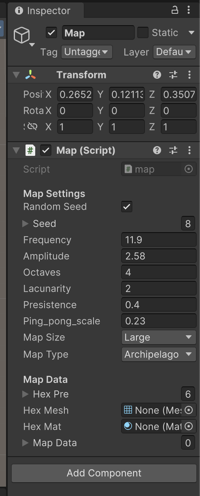

# MapGenerator - still in progress
Map Generator is my script writed in C# to procedural generation hexagonal map to TBS game. It was created in mind to integrate with Unity Engine, and can be used in strategic games and other which needs hexagonal map. 
Aim that script is to generate map to my game idea "Hexiv", which will be mainly TBS mobile game. 
(Currently it only generate shapes of terrains without biomes, and only Archipelago and Lakes works. Rest of configurations aren's satisfies me.)
## Generation Method
1. [Perlin noise](https://en.wikipedia.org/wiki/Perlin_noise) - I'm using a perlin noise with some modifications like octaves, frequency and amplitude to get an expected results. Also I wrote pin pong modification to make rivers, but I didn's used it yet.
2. [Voronoi Diagram](https://en.wikipedia.org/wiki/Voronoi_diagram) - I'm using a logic from Voronoi diagram generation, but with modifications. Instead creating all diagram, I'm creating some points with coordinates and for each center of hex, I'm finding the nearest "Voronoi point" and assign that point attribute to hex.
# Configurations
## Maps Genetation options
1. Seed
2. Map Size
* Duel (44x26)
* Tiny (60x38)
* Small (74x46)
* Standard (84x54)
* Large (96x60)
4. Map Type
* Continents - a few massive continents
* Pangea - one supercontinent
* Archipelago - many little islands
* Small Continents - more, but smaller continents
* Continents and Islands - continents, but more little islands
* Lakes - mainly land, but with some water reservoirs
## Config in Unity Engine
There is a panel with settings to configure map options and test a parameters of Perlin Noise  

# Visualization

